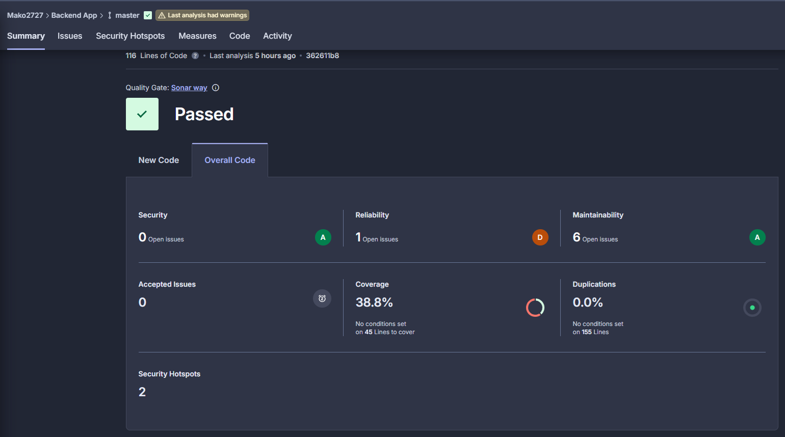
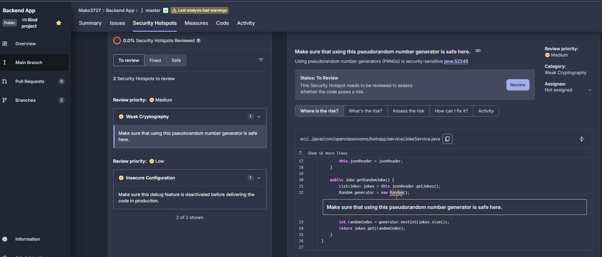

🎨 Frontend – Angular  (version 14.2.0)  
🧩 Installation locale  

Pour développer ou tester localement le front-end :  

cd front  
npm install  
npm start  

L’application sera accessible sur http://localhost:4200
.

⚙️ CI – GitHub Actions (Intégration Continue)  
📄 Fichier : .github/workflows/front-ci.yml  

	👉 Ce workflow se déclenche uniquement sur un push sur la branch Feature-Branch et pour des modifications sur le répertoire Front  

	On indique que les tests vont s exécuter sur une machine virtuelle Ubuntu  
	Récupère le code source de ton dépôt pour que les étapes suivantes puissent y accéder.   
	Installe Node.js version 18, nécessaire pour exécuter Angular  
	exécuter les tests Angular avec Karma en mode Headless (Chrome sans interface graphique).  
	Installe toutes les dépendances  
	Lance les tests avec Karma et génération de la couverture de test  
	Upload de l’artefact pour SonarCloud  
	Analyse SonarCloud dédiée au front-end  

  
👉 Pour déclencher le CD, assurez-vous que les KPI sur SonarCloud sont respectés, puis réalisez le merge de la branche feature vers main.

🚀 CD – GitHub Actions (Déploiement Continu)  
📄 Fichier : .github/workflows/front-cd.yml  

	On indique que les tests vont s exécuter sur une machine virtuelle Ubuntu  
	Récupère le code source de ton dépôt pour que les étapes suivantes puissent y accéder.  
	Installe la version 18 de Node.js, nécessaire pour exécuter Angular  
	Installe toutes les dépendances  
	Lance les tests avec Karma pour vérifier que le front reste stable avant le déploiement.  
	Génère le build optimisé de l’application  
	Connexion à Docker Hub  
	Pousse ensuite l’image sur Docker Hub  

🎨 Backend – Spring Boot  (Java 11)  
🧩 Installation locale  

Pour développer ou tester localement le back-end :

	cd back  
	mvn clean install  
	mvn spring-boot:run  

	L’API sera accessible sur http://localhost:8080  

⚙️ CI – GitHub Actions (Intégration Continue)  
📄 Fichier : .github/workflows/back-ci.yml  

👉 Se déclenche uniquement sur un push sur la branch Feature-Branch et pour des modifications sur le répertoire Back  

	On indique que les tests vont s exécuter sur une machine virtuelle Ubuntu  
	Récupère le code source de ton dépôt pour que les étapes suivantes puissent y accéder.  
	Installe Java 11 (distribution Temurin).  
	Exécution des tests Maven + génération du rapport de couverture  
	Push sur sonar et analyse du code avec SonarCloud  

👉 Pour déclencher le CD, assurez-vous que les KPI sur SonarCloud sont respectés, puis réalisez le merge de la branche feature vers main.  

🚀 CD – GitHub Actions (Déploiement Continu)  
📄 Fichier : .github/workflows/cd-back.yml  

	Se déclenche uniquement sur un push sur la branch Main et pour des modifications sur le répertoire Back  

	On indique que les tests vont s exécuter sur une machine virtuelle Ubuntu  
	Récupère le code source de ton dépôt pour que les étapes suivantes puissent y accéder.  
	Installe Java 11  
	Exécution des tests et génération du rapport JaCoCo  
	Build du projet Maven (package)  
	Connexion à Docker Hub  
	Build et push de l’image Docker backend  

🧠 Analyse des métriques et des retours utilisateurs  
KPI a suivre
Coverage (Back end)  
	il serait bien de réaliser plus de test unitaire et d'intégration pour que ce seuil ateigne au moins 80%  
  

Security hotspot (back end)  
	une correstion serait souhaitable pour remedier a cette potentioel faille de sécurité  
  

Notes et avis  

**Backend :**  
	Coverage actuel du back: 38,8%, largement inférieur au seuil minimal attendu (ex. 80%).  
	Action prioritaire : Ajouter des tests unitaires et d’intégration pour augmenter la couverture, surtout sur les composants critiques.  
	Security Hotspots Reviewed : 0,0%.  
	Action prioritaire : Examiner et valider les points de sécurité détectés par SonarCloud pour éviter les vulnérabilités potentielles.  

**Frontend :** 
	Les rapports de sonar sur la partie Front sont actuellement corrects. Il faut tout de même continuer à les viser pour ne pas dériver.  

**Retours utilisateurs :** Les développeurs apprécient la visibilité immédiate de la qualité du code grâce à SonarCloud.  
L’analyse des métriques et des retours utilisateurs permet d’évaluer la qualité globale du pipeline, la stabilité du code et la satisfaction des équipes.  
Ces indicateurs aident à identifier les axes d’amélioration, que ce soit sur le temps de build, la couverture des tests ou l’expérience développeur.